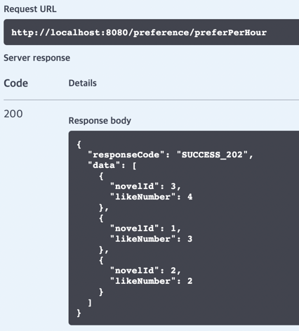
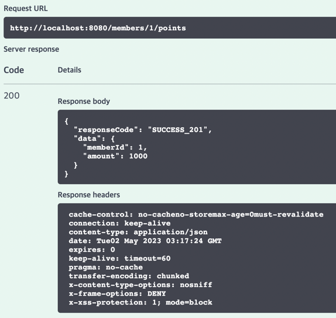
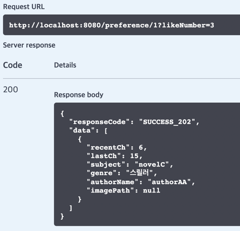

# 웹소설 서비스 REST API
## ERD 설계

## REST API 설계

➡️ [API 명세](https://hushed-bite-bb4.notion.site/10674566d0754dd08666da7a2b8ff188?v=e6318d3b059f48e1a7c732ff7ac42d7f)

## API 구성
> Swagger 를 활용해 API 테스트를 진행했다. 다음은 본 프로젝트에서 다룬 대표적 기능들에 대한 API 요청과 응답 결과이다.
### 선호작 조회(1시간 간격으로 갱신, 캐싱 사용)

### 포인트 중복 충전 요청 (동시성 문제 해결)

### 회원 별 선호작 목(해당 회원이 선호하는 작품 목록 조회, N+1 문제 해결)

## 프로젝트에서 다룬 내용
프로젝트를 진행하며 고민하고 해결해 본 내용들입니다.     
모든 개발 과정은 다음 링크에서 확인하실 수 있습니다. ➡️ [개발 과정 링크](https://velog.io/@daryu519/series/%EC%9B%B9%EC%86%8C%EC%84%A4-%EC%84%9C%EB%B9%84%EC%8A%A4-%EA%B0%9C%EC%9D%B8-%ED%94%84%EB%A1%9C%EC%A0%9D%ED%8A%B8)
### 1. 동시성 문제 해결
> 특정 유저가 동일한 포인트 충전 요청을 N 번 시도했을 때, 한 번만 충전되어야 합니다.

위 문제를 해결하기 위해 다음과 같은 사항들을 고려해봤습니다.
- PESSIMISTIC_WRITE (비관적 락)
- Redis의 분산 락
### 2. 캐싱을 통해 조회 성능 향상
> 전체 소설 중 선호도가 가장 높은 순서대로 '베스트 소설'이 조회되어야 합니다.   
> 베스트 소설 목록은 1시간 간격으로 갱신됩니다.

베스트 소설 목록은 모든 유저가 공유하는 내용이고, 크게 바뀌지 않기 때문에 '캐싱'을 고려했습니다.       

### 3. N+1 문제 해결을 위한 페치 조인 적용
> 해당 회원이 ‘선호’하는 소설 목록을 보여줘야 합니다.    
> 응답은 소설의 마지막 화, 회원이 가장 최근에 읽은 회차를 포함해야 합니다.

강의를 통해 들었던 N+1 문제를 직접 마주치고 해결해봤습니다.     
추가적으로 주어진 요구사항(소설의 마지막 화, 최근 읽은 회차)에 대해 어떻게 API에 포함시킬지 고민해봤습니다.

## 기술 스택
- Java 17
- Spring Data JPA
- Spring Security
- MySQL
- Redis
- Spock

## 성과(결과)
- spock 테스트 코드를 활용한 BDD 개발 방법에 대해 알게 되었습니다.
- Redis를 활용해 캐싱을 진행하였고, 기존 조회 속도보다 약 37.5배 더 빠른 조회 성능 개선을 측정했습니다.
- 샘플 데이터 기준 기존 약 50개(N)의 쿼리가 추가적으로 발생한 부분을 페치 조인을 통해 1개로 줄였습니다. (N+1 문제 해결)
- 동시성 문제에 대해 다양한 해결 방법론을 적용해보았고, 최종적으로 Redis의 분산 락 개념을 통해 해결했습니다.
- REST API 설계 원칙, Swagger 사용법 및 API 테스팅에 대해 공부하고 적용해봤습니다. 
- 응답 객체, 응답 코드, 각 계층 별 책임원칙에 대한 유지보수를 진행해 공통 부분을 묶어내고 변경 지점을 최소화 했습니다.
- 엔티티 - dto 의 쉽고 빠른 전환을 위해 Builder 패턴이 아닌 ModelMapper 를 다뤄보았습니다.

## 아쉬운 점
> 추후 보안할 내용들, 프로젝트를 진행하면서 아쉬웠던 점을 정리했습니다.
- 대용량 데이터 처리에 대한 부분은 시간 관계 상 다루지 못했습니다.
- 동시성 문제를 해결하는 과정에서, 단일 서버에서는 비관 락을 통해 충분히 해결할 수 있다고 생각하지만 분산 락 개념을 통해 해결했습니다.
- 실제로 어떻게 작동할지와 관련한 프로파일링 측정 부분을 다루지 못했습니다.